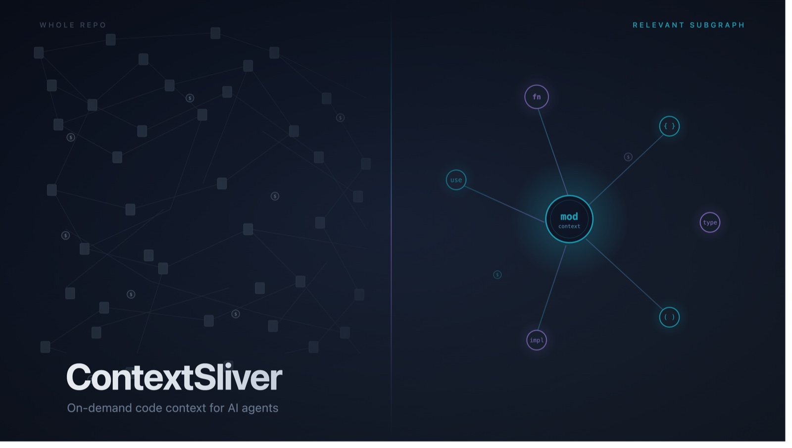

# ContextSliver

> A lightweight, always-live code-context MCP server for AI coding agents — with per-session
> deduplication so token cost goes *down* over a conversation.

<p align="center">
  
</p>

[](https://github.com/DevMuneeb/contextsliver/actions/workflows/ci.yml)
[](https://opensource.org/licenses/MIT)
[](https://www.npmjs.com/package/contextsliver)

## The problem

When you ask an AI coding agent (Claude Code, Cursor, Copilot) to *"fix the bug in AuthService,"*
it repeatedly reads entire files to find the 5% that's relevant — burning 40,000–80,000 tokens on
a question that needed ~3,000.

```text
find . -name "*.ts"   → 2,000 tokens (a file listing)
cat AuthService.ts    → 3,000 tokens (whole file)
grep -r "AuthService" → 5,000 tokens (40 matches)
cat AuthMiddleware.ts → 2,500 tokens (whole file, again)
... × 10 more ...
```

## What ContextSliver does

ContextSliver runs as a background **MCP server** on your machine. It indexes your codebase into a
local SQLite graph of every function, class, and import. When the agent needs context, it calls an
MCP tool instead of reading files:

```text
Agent:   "What connects to AuthService? Budget: 2,000 tokens."

ContextSliver:
  symbol:        AuthService  (src/auth/AuthService.ts)
  callers:       [AuthMiddleware, LoginController]      ← who uses it
  dependencies:  [UserRepository, TokenService]         ← what it uses
  already_in_context: [UserRepository]                  ← skipped, agent already has it
  // ~380 tokens
```

### Three things that make it different

1. **Always-live, not a snapshot** — a file watcher updates the SQLite index on every save. There's
   no "rebuild the graph" step and no stale artifact between commits; queries run against your code's
   *current* state.
2. **Per-session deduplication** — the session ledger tracks exactly what the agent has already
   *received this conversation* and skips it on later calls (listing it in `already_in_context`).
   Token cost **decreases over a session** — nobody else does this.
3. **Zero-Python, pure Node** — one command (`npx contextsliver init`), no Python/`uv` runtime, no
   API keys, no separate database server. Built for TypeScript/JavaScript shops that don't want a
   Python dependency in their toolchain.

## How it compares

ContextSliver is a focused, early-stage tool. It is **not** a feature-for-feature replacement for
more mature alternatives — and that's intentional. Here's an honest breakdown:

| | **ContextSliver** | [Graphify](https://github.com/safishamsi/graphify) | [Aider repo-map](https://aider.chat/docs/repomap.html) | [Repomix](https://github.com/yamadashy/repomix) |
|---|---|---|---|---|
| **Languages** | TS/JS, Python | 36 | many (tree-sitter) | n/a (text) |
| **Indexing model** | live service (save → reindex) | committed snapshot | per-message map | one-off pack |
| **Session dedup** | ✅ **per-conversation** | project-level memory | ❌ | ❌ |
| **Requires Python** | ❌ (pure Node) | ✅ (Python 3.10+, uv) | ✅ (Python) | Node CLI |
| **Scope** | code symbols only | code + docs + media + infra | code symbols | whole-repo text |
| **Maturity** | v0.1 (new) | YC-backed, mature | mature | mature |

**When to pick ContextSliver:**
- You work in **TypeScript/JavaScript** and don't want a Python dependency
- You want a **live** index that updates as you edit, not a snapshot you rebuild
- You care about **per-session token deduplication** during long agent conversations
- You want a **focused, hackable** tool (small codebase, easy to contribute a language plugin)

**When to pick something else:**
- **Graphify** — if you want the most capable option today (36 languages, semantic extraction,
  docs/media indexing, PR tooling, visualizations). It's the more complete product.
- **Aider** — if you want a battle-tested agent *with* a built-in repo map, and you're happy in Python.
- **Repomix** — for a one-shot "explain my whole repo to an LLM" task.

ContextSliver's niche is being **lightweight, live, and session-aware** — not competing on breadth.

## Quickstart

```bash
# In your project root:
npx contextsliver init      # creates .sliver/, .mcp.json, CLAUDE.md, copilot-instructions.md, indexes the repo
npx contextsliver start     # runs the MCP server + file watcher (stdio)
```

Then restart Claude Code / Cursor / Cline / Copilot — they'll pick up the tools via the generated
config and instruction files. See the [templates](./templates) for client-specific config.

## The five MCP tools

| Tool | What it does | Typical tokens |
|------|-------------|---------------|
| `cs_get_context` | Symbol definition + immediate connections; starts a session | ~300–800 |
| `cs_blast_radius` | All callers + dependents up to N hops | ~500–2,000 |
| `cs_search_symbols` | Search across indexed symbols by name/path | ~200–600 |
| `cs_index_status` | Index health, file count, last-updated | ~100 |
| `cs_index_repo` | Trigger a full re-index | ~50 |

Pass the `session_id` from your first `cs_get_context` call to every subsequent call to enable
deduplication.

## Supported languages

- **TypeScript / JavaScript / TSX** (v0.1)
- **Python** (v0.1)
- Go, Rust, Java — planned (see [roadmap](#roadmap))

Adding a language = add a grammar package + a `grammars/<lang>/tags.scm` query + a fixture. See
[CONTRIBUTING.md](./CONTRIBUTING.md).

## How it works

```text
Your codebase  ──chokidar──▶  Parser (Tree-sitter)  ──▶  SQLite graph (.sliver/index.db)
                                                                    │
                              MCP server (stdio) ◀──────────────────┘
                                    │   session ledger (.sliver/index.db)
                                    ▼
                    Claude Code / Cursor / Cline / Copilot
```

- **Parser**: Tree-sitter extracts symbols + imports per file.
- **Graph engine**: stores symbol→symbol edges; bidirectional BFS (`blastRadius`) for blast radius
  with cycle detection.
- **Session manager**: per-session ledger computes deltas so already-sent context is skipped.
- **MCP server**: exposes the five tools over stdio.
- **File watcher**: debounced incremental re-index on every save (hash-based skip of unchanged files).

## Token counting

Counts use [`gpt-tokenizer`](https://www.npmjs.com/package/gpt-tokenizer) (`cl100k_base`) and are
labeled **~approximate** — close enough for budget guidance, not billing.

## Development

```bash
npm install
npm test            # unit + integration tests
npm run test:bench  # indexing benchmarks
npm run build       # tsc → dist/
npm run lint        # eslint
```

Requires Node ≥ 20.

## Roadmap

- **v0.1** ✅ TS/JS + Python, SQLite graph, session ledger, 5 tools, CLI, watcher
- **v0.2** — incremental indexing polish, Cursor integration, CI benchmarks
- **v0.3** — Go + Rust, monorepo workspace resolution, language-plugin docs
- **v0.4** — PreToolUse hook, Java, published token-reduction benchmarks
- **v0.5** — Streamable HTTP transport, DuckDB backend for 50k-file repos, PageRank ranking
- **v1.0** — frozen API, optional native (napi-rs) engine, SCIP/LSP precision backend

See [`contextsliver-spec.md`](./contextsliver-spec.md) for the full specification and
[`DEVELOPMENT_LOG.md`](./DEVELOPMENT_LOG.md) for the development retrospective.

## License

MIT © DevMuneeb
